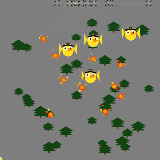

# aSwam: Adaptive Firefighting Drone Swarm RL Model

## Firefighting Drone Swarm in Action
[](FirefighterDrone.mp4)
[Download or play FirefighterDrone.mp4](FirefighterDrone.mp4)

---

## 1. Introduction

This project implements an autonomous drone swarm system for firefighting, combining classical robotics (potential fields) with deep reinforcement learning (PPO with LSTM). The swarm must coordinate to extinguish multiple fires in a forest environment, avoiding dynamic obstacles (birds) and working under realistic constraints.

**Key innovation:** The RL agent does not control drones directly. Instead, it controls a single "attraction point" that guides the swarm, enabling emergent, coordinated behaviors.

---

## 2. Key Innovations
- **Indirect Swarm Control:** RL agent controls a single attraction point.
- **Hybrid Control:** Combines potential fields with RL adaptation.
- **Temporal Modeling:** LSTM for sequential swarm behavior.
- **Multi-Objective Learning:** Balances fire suppression, collision avoidance, and exploration.

---

## 3. System Overview
### 3.1 Environment Components
- **Drones:** Water-ejecting quadcopters, coordinated by the RL agent.
- **Fires (Targets):** Static (or optionally dynamic) locations requiring multi-drone cooperation to extinguish.
- **Obstacles:** Moving birds that create collision hazards.
- **Forest Environment:** Visual elements (trees, terrain) for realism.

### 3.2 Key Features
- Multi-agent coordination via indirect control.
- Dynamic obstacles and static/dynamic fires.
- Sensor-based perception (radial sensors).
- Adaptive control via RL-learned potential field parameters.

---

## 4. Mathematical Foundation: Potential Fields
### 4.1 Control Strategy
- **Attractive Force:** Drones are attracted to a single agent-controlled target point, not directly to fires.
- **Repulsive Forces:** Drones are repelled by obstacles, other drones, and boundaries.
- **Force Limiting:** All forces are clamped to prevent instability.

#### Net Force Equation
The net force on drone *i* is:
```math
\\vec{F}_i^{net} = \\vec{F}_i^{att} + \\sum_{j} \\vec{F}_{ij}^{rep,obs} + \\sum_{k \\neq i} \\vec{F}_{ik}^{rep,drone} + \\vec{F}_i^{rep,boundary}
```

#### Attractive Force
```math
\\vec{F}_i^{att} = 
\\begin{cases}
k_{att} \\cdot d_{target} \\cdot \\hat{r}_{target} & \\text{if } d_{target} > \\epsilon \\\\
\\vec{0} & \\text{otherwise}
\\end{cases}
```
Where:
- $k_{att}$ = attraction strength parameter (dynamically adjusted by agent)
- $d_{target}$ = distance to agent-controlled target position
- $\\hat{r}_{target}$ = unit vector toward agent-controlled target

#### Repulsive Forces
**Obstacle Repulsion:**
```math
\\vec{F}_{ij}^{rep,obs} = 
\\begin{cases}
k_{obs} \\cdot \\left(\\frac{1}{d_{ij}} - \\frac{1}{r_{obs}}\\right) \\cdot \\frac{1}{d_{ij}} \\cdot \\hat{r}_{ij} & \\text{if } \\epsilon < d_{ij} < r_{obs} \\\\
\\vec{0} & \\text{otherwise}
\\end{cases}
```
**Inter-Drone Repulsion:**  
Similar formula for drone-to-drone repulsion.
**Boundary Repulsion:**
```math
\\vec{F}_i^{rep,boundary} = k_{boundary} \\cdot \\left(\\frac{1}{d_{boundary}} - \\frac{1}{r_{boundary}}\\right) \\cdot \\hat{n}_{boundary}
```

#### Force Limiting
```math
\\vec{F}_{limited} = 
\\begin{cases}
\\vec{F} & \\text{if } |\\vec{F}| \\leq F_{max} \\\\
F_{max} \\cdot \\frac{\\vec{F}}{|\\vec{F}|} & \\text{otherwise}
\\end{cases}
```

---

## 5. Mathematical Foundation: Reinforcement Learning
### 5.1 State Space
- **Per-Drone:** Normalized position, sensor readings, fire proximity.
- **Global:** Nearest detected fire positions.

### 5.2 Action Space
- **Target Position:** (x, y) coordinates for the attraction point.
- **Potential Field Parameters:** (optionally) normalized values for attraction/repulsion strengths.

### 5.3 Network
- **Recurrent PPO (LSTM):** Captures temporal dependencies in swarm behavior.
- **Policy/Value Heads:** For action selection and value estimation.

---

## 6. Reward Structure
- **Step Penalty:** Negative reward per step (efficiency).
- **Fire Extinguished:** Positive reward per fire.
- **Drone Crash:** Negative reward.
- **All Drones Lost/All Fires Out:** Large terminal rewards.
- **Hitting Reward:** Small reward for being near fires.
- **Intrinsic Reward:** Encourages exploration (state visitation frequency).

All rewards are scaled for stable learning.

---

## 7. Fire Extinguishing Mechanics
- **Multi-Drone Requirement:** Fires require several drones in proximity for multiple steps.
- **Static/Dynamic Fires:** By default, fires are static; can be made dynamic by adjusting parameters.

---

## 8. Sensor System
- **Radial Sensors:** Each drone uses multiple rays to detect obstacles and fire locations.
- **Ray-Marching:** Incremental distance checking for collision detection.

---

## 9. Training Process
- **Algorithm:** Proximal Policy Optimization (PPO) with LSTM.
- **Curriculum:** Initial safety period, progressive difficulty, regular checkpointing.
- **Visualization:** Real-time rendering of drones, fires, obstacles, and the agent's target point.

---

## 10. Visualization
- **Drones:** Blue quadcopters with animated propellers.
- **Fires:** Animated flames.
- **Birds:** Animated obstacles.
- **Agent's Target:** Blue circle showing the attraction point.
- **Sidebar:** Displays episode stats, rewards, and PF parameters.

---

## 11. System Behavior Diagrams
### 11.1 Force Field Visualization
```
    Agent's Target Point (Controlled by RL)
            ↓
    [Attractive Force]
            ↓
         Drone ←――→ Drone
            ↑      [Repulsion]
    [Repulsive Forces]
       ↑    ↑    ↑
    Bird  Wall  Bird

    Fire Locations (Observed but not attracting)
     🔥    🔥    🔥

The agent must learn to position the target near fires!
```

### 11.2 Multi-Drone Coordination
```
    Fire Location
     ⚡ ⚡ ⚡
    ╱  ╱  ╲  ╲
   D1  D2  D3  D4

Required: Multiple drones within proximity for sustained duration
```

### 11.3 Control Flow
```
Observation → LSTM-PPO → Action
     ↓                      ↓
[Drone Positions,      [Target Position (x,y),
 Sensors,               PF Parameters]
 Fire Locations]            ↓
                    Agent's Target Point
                            ↓
                    Attractive Force to Target
                            ↓
                    Drone Movement → Fire Proximity → Extinguishing
```

### 11.4 Direct vs Indirect Control Comparison
```
Traditional Direct Control:          This System's Indirect Control:
                                    
Fire ←― Drone                       Fire     Agent's Target
Fire ←― Drone                        🔥          ⊕
Fire ←― Drone                                    ↓
                                    Drone ――――→ ⊕
Drone ←― Fire                       Drone ――――→ ⊕
Drone ←― Fire                        🔥          ⊕
Drone ←― Fire                       Fire     Agent's Target

(Each drone attracted               (All drones attracted to 
 directly to fires)                 single agent-controlled point)
```

---

## 12. Implementation Structure
- `swarmdrl_firefighter.ipynb`: Main notebook with environment, training, and evaluation code.
- `DroneSwarmEnv`: Custom Gym environment implementing the simulation and RL interface.
- `RenderCallback`: For periodic rendering during training.
- `requirements.txt`: Python dependencies.

---

## 13. Usage
1. **Install dependencies:**  
   ```zsh
   pip install -r requirements.txt
   ```
2. **Run the notebook:**  
   Open `swarmdrl_firefighter.ipynb` in Jupyter Lab/Notebook and execute cells in order.
3. **Train the model:**  
   The notebook includes code for initial training, retraining, and evaluation.
4. **Visualize:**  
   Rendering is integrated for both training and evaluation.

---

## 14. Experimental Results
- **Emergent Behaviors:** Strategic target placement, formation flying, obstacle avoidance, dynamic regrouping.
- **Metrics:** Mission success rate, drone efficiency, time performance, exploration coverage, coordination quality.

---

## 15. License
See `LICENSE` for details.

---

## 16. References
- [swarmdrl_firefighter.ipynb](swarmdrl_firefighter.ipynb): Full implementation and experiment details.

---

## Additional Training Video Examples

Below are sample videos showing the drone swarm RL training at different stages:

### 1. 50 Million Timesteps (Late Training)
[](PPOPOswarm_50m_training.mp4)
[Download or play PPOPOswarm_50m_training.mp4](PPOPOswarm_50m_training.mp4)

---

### 2. Early Stage Training
[](PPOPOswarm_earlystage_training.mp4)
[Download or play PPOPOswarm_earlystage_training.mp4](PPOPOswarm_earlystage_training.mp4)

---

### 3. 10 Million Timesteps (Mid Training)
[](PPOPOswarm_10m_training.mp4)
[Download or play PPOPOswarm_10m_training.mp4](PPOPOswarm_10m_training.mp4)